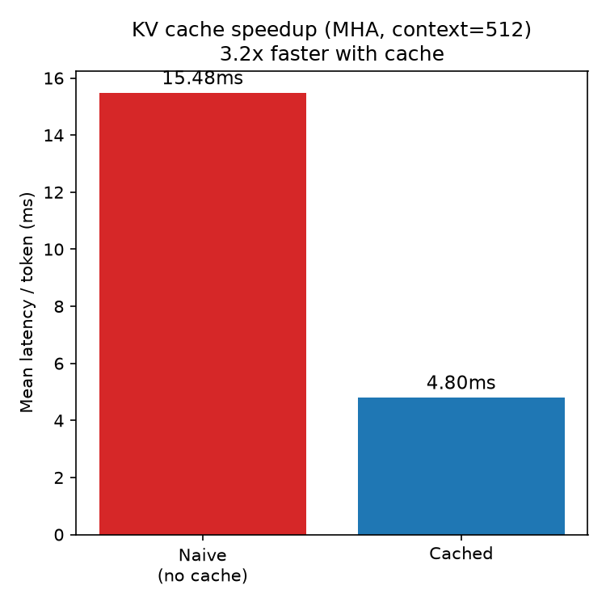

# Transformer Inference Lab

**Research question:** How does attention architecture affect the memory–latency–quality trade-off during autoregressive language-model inference?

Follow-up to [gpt2-speedrun](https://github.com/modestesavadogo/gpt2-speedrun). Where that project was about reproducing training, this one is about understanding *inference* well enough to explain, with measurements, why production LLM serving engines (vLLM, TensorRT-LLM) use techniques far more sophisticated than what's built here.

**Status:** core experiments complete (training, latency, memory, throughput benchmarks for all three variants, figures generated). The FlashAttention/PagedAttention writeup is the one remaining open item — see [Conclusions](#conclusions). See [BUILDLOG.md](BUILDLOG.md) for the full session-by-session history, including bugs hit and how they were resolved. The exact Kaggle notebooks used are in [`notebooks/`](notebooks/) (outputs cleared before committing).

All training and benchmarking in this project was run on Kaggle (T4 GPU), not locally.

---

## Problem

Naive autoregressive decoding recomputes attention over the entire prefix at every generation step. Total compute across a full generation is O(T²) in sequence length T — each new token re-processes every token that came before it, even though most of that work was already done in the previous step.

Measured directly on this project's MHA checkpoint (context length 512, 64 generated tokens): **15.48ms/token** with naive decoding. The obvious fix is a KV cache — store the Key/Value projections computed for already-processed positions instead of recomputing them — but the size of that cache, and how expensive it is to read at every step, depends entirely on the attention architecture. That dependency is the actual subject of this project: not whether caching helps (it obviously does), but how the choice between Multi-Head Attention (MHA), Grouped-Query Attention (GQA), and Multi-Query Attention (MQA) changes the memory, latency, and throughput of that caching in practice — not just in theory.

## Theory

**Why the KV cache is the lever.** Once a token's Key and Value vectors are computed, they never change — attention is causal, so position *i* only ever attends to positions ≤ *i*. Caching them turns an O(T²) generation into O(T), at the cost of memory proportional to sequence length.

**Why attention variant changes the cache size.** MHA gives every query head its own Key/Value projection. GQA and MQA reduce the number of independent KV projections, sharing them across groups of query heads:

| Variant | Query heads (Hq) | KV heads (Hkv) | KV cache vs MHA |
|---|---|---|---|
| MHA | 8 | 8 | 1× (baseline) |
| GQA | 8 | 2 | 4× smaller |
| MQA | 8 | 1 | 8× smaller |

The KV cache size for one layer, one sequence:

```
2 (K and V) × n_kv_head × seq_len × head_dim × dtype_bytes
```

Only the KV projection shrinks as `n_kv_head` drops — the Q and output projections stay full size, so this is specifically a *KV-cache memory* optimization, not a general parameter-count reduction. This formula is what [Results](#results) checks against actual measured allocator output.

References: Shazeer, *Fast Transformer Decoding: One Write-Head Is All You Need* (2019); Ainslie et al., *GQA: Training Generalized Multi-Query Transformer Models from Multi-Head Checkpoints* (2023).

## Implementation

Everything below is built from scratch on top of a nanoGPT-style model: naive decoding → KV cache → MHA → GQA → MQA → benchmarking. Nothing here imports an existing fused-attention library — the point was to understand the mechanism by writing it, including the parts (like `repeat_kv`'s broadcast cost) that turned out to matter for the actual results.

**What was built:**
- A KV cache from scratch (`src/model/cache.py`) — pre-allocated per-layer storage with explicit append/read logic
- A single parameterized attention module (`src/model/attention.py`) that reduces to MHA, GQA, or MQA depending on `n_kv_head`
- Two decoding paths (`src/inference/naive.py`, `src/inference/kv_cache.py`) — naive (recompute everything, every step) and cached (prefill once, then incremental) — so the KV-cache speedup itself could be measured, not just asserted
- Reproducible benchmark CLIs for latency, memory, and throughput (`benchmarks/`)
- A training script (`train.py`) and three configs (`configs/mha.yaml`, `gqa.yaml`, `mqa.yaml`) identical except for `n_kv_head`

### Setup

```bash
git clone https://github.com/modestesavadogo/transformer-inference-lab.git
cd transformer-inference-lab
python -m venv .venv && source .venv/bin/activate
pip install -r requirements.txt
pytest tests/  # correctness checks before trusting any benchmark
```

### Running on Kaggle

Training and all benchmarks in this repo were run as Kaggle notebooks (T4 GPU), not locally — a full training run takes ~2.5-3h per variant, impractical without a dedicated GPU.

1. **Data:** `prepare_data.py` streams FineWeb-Edu and tokenizes with tiktoken's `gpt2` encoding, writing `train.bin`/`val.bin` (uint16 memmap arrays). On Kaggle, generate once and save as a reusable Dataset:
   ```bash
   python prepare_data.py --num_tokens 50_000_000 --out_dir data
   ```
2. **Training:** one notebook per variant (`configs/mha.yaml`, `gqa.yaml`, `mqa.yaml`), each producing a checkpoint saved to a shared Kaggle Dataset for reuse across sessions.
3. **Benchmarks:** a separate notebook loads all three checkpoints and runs `benchmarks/latency.py`, `memory.py`, `throughput.py` across each.

**Known constraint:** `context_length + max_new_tokens` must stay at or below `block_size` (1024 for these checkpoints) — positions beyond `block_size` don't exist in the position embedding table. Exceeding it triggers a CUDA device-side assert that **poisons the CUDA context for the rest of the process** (a kernel/session restart is required, not just a retry). All commands below use values that respect this constraint.

### Reproducing results

Every number in this README comes from a command you can re-run. Benchmark scripts must be run with `-m` (module syntax), not as a direct file path, since they use package-relative imports:

```bash
python -m benchmarks.latency \
    --attention gqa \
    --kv-heads 2 \
    --context-length 512 \
    --max-new-tokens 128 \
    --checkpoint results/checkpoints/gqa.pt \
    --out results/latency/gqa_ctx512.json \
    --device cuda

python -m benchmarks.throughput \
    --attention mqa --kv-heads 1 \
    --context-length 512 --max-new-tokens 64 \
    --checkpoint results/checkpoints/mqa.pt \
    --batch-sizes 1,4,8,16,32,64 \
    --device cuda

python -m benchmarks.memory \
    --attention mha --kv-heads 8 \
    --context-lengths 256,512,768 \
    --checkpoint results/checkpoints/mha.pt \
    --device cuda

python analysis/plots.py --results-dir results/ --out-dir results/figures/
```

Training the three attention variants:

```bash
python train.py --config configs/mha.yaml --device cuda
python train.py --config configs/gqa.yaml --device cuda
python train.py --config configs/mqa.yaml --device cuda
```

`configs/{mha,gqa,mqa}.yaml` are identical except for `n_kv_head` — same seed, same token budget, same data — so quality differences in the results below are attributable to architecture, not training discrepancy. This matters: an earlier design considered slicing one trained MHA checkpoint down to simulate GQA/MQA, which is cheaper but only measures what happens when you break a model, not what the architectures actually cost — training three separate checkpoints from scratch is what makes the quality comparison meaningful.

## Experiments

All three checkpoints (MHA, GQA `n_kv_head=2`, MQA `n_kv_head=1`) were trained for 5000 iterations on 50M tokens — identical seed, data, and hyperparameters, differing only in `n_kv_head` — then benchmarked at context lengths 256/512/768 (capped below `block_size=1024` to leave room for generated tokens).

Three benchmarks were run per checkpoint:
- **Memory** (`benchmarks/memory.py`) — KV cache size at each context length, measured against the theoretical formula from [Theory](#theory)
- **Latency** (`benchmarks/latency.py`) — mean ms/token at batch size 1, cached decoding, at each context length; plus one naive (no-cache) run for the KV-cache speedup comparison
- **Throughput** (`benchmarks/throughput.py`) — tokens/sec at context length 512, sweeping batch size from 1 to 64

Quality was measured as validation loss at the final training iteration (5000), single seed per variant — this limitation (single seed, short budget) is addressed directly in [Conclusions](#conclusions).

## Results

**KV cache speedup over naive decoding** (MHA, context length 512):



`4.80ms/token` cached vs `15.48ms/token` naive — a **3.2× speedup**, independent of attention variant, since all three benefit from caching equally at the mechanism level.

**Memory** — KV cache size, measured vs. theoretical formula:

| Context | MHA (bytes) | GQA (bytes) | MQA (bytes) | GQA ratio | MQA ratio |
|---|---|---|---|---|---|
| 256 | 2,949,120 | 737,280 | 368,640 | 4.00× | 8.00× |
| 512 | 5,308,416 | 1,327,104 | 663,552 | 4.00× | 8.00× |
| 768 | 7,667,712 | 1,916,928 | 958,464 | 4.00× | 8.00× |

Measured and theoretical values are identical at every data point.


**Latency** (batch=1, mean ms/token):

| Context | MHA | GQA | MQA |
|---|---|---|---|
| 256 | 4.93 | 5.41 | 5.69 |
| 512 | 4.80 | 5.33 | 5.62 |
| 768 | 4.76 | 5.75 | 5.25 |


**Throughput** (tokens/sec, context=512, sweeping batch size):

| Batch | MHA | GQA | MQA |
|---|---|---|---|
| 1 | 108.7 | 97.0 | 96.5 |
| 4 | 683.5 | 647.9 | 689.3 |
| 8 | 1389.2 | 1219.9 | 1348.8 |
| 16 | 2075.6 | 2068.5 | 2298.5 |
| 32 | 2298.8 | 2319.0 | 3484.1 |
| 64 | 2336.8 | 2334.7 | 3830.1 |

No OOM occurred at any batch size tested, for any variant.


**Quality** (val_loss at iteration 5000, single seed, single run per variant):

| Variant | val_loss |
|---|---|
| MHA | 5.6314 |
| MQA | 5.6856 |
| GQA | 5.7637 |

## Conclusions

The results split into two regimes that the single-sequence and batched benchmarks each expose separately.

**Memory scales exactly as predicted, independent of everything else.** Across all three context lengths, GQA's KV cache is precisely 4× smaller than MHA's and MQA's is precisely 8× smaller — matching the formula from [Theory](#theory) to the byte, with zero drift between theoretical and measured allocator numbers. This is the one result in this project with no ambiguity: the architecture does exactly what it's supposed to do to the KV cache.

**At batch size 1, MHA is consistently the fastest, not the slowest.** Latency stays essentially flat for MHA across all three context lengths (~4.8ms), while GQA and MQA are both 10-20% slower. The reason traces to the implementation, not noise: MHA's `repeat_kv` operation takes a no-op fast path when `n_kv_head == n_head` (`n_rep == 1`), while GQA and MQA both pay a real broadcast cost (`expand` + `reshape`) on every forward pass to bring their smaller KV tensor up to the query head count. At this model size (28-30M parameters) and batch size 1, that broadcast cost outweighs any benefit from reading less cache memory — the GPU simply isn't memory-bandwidth-bound at this scale, so a smaller cache has no bandwidth savings to offer against a real per-step compute overhead.

**At high batch size, the picture reverses — but only for MQA, not GQA.** By batch=64, MQA reaches 3830 tokens/sec, a 64% improvement over MHA and GQA, both of which plateau around 2335 tokens/sec. This is the regime the KV-cache-size argument for GQA/MQA is actually built for: total memory traffic scales with `batch_size × kv_cache_bytes`, and once batch size is large enough, that traffic — not the fixed broadcast cost — becomes the bottleneck. MQA's 8× smaller cache produces a corresponding real speedup once that threshold is crossed.

GQA does not show this effect at any batch size tested, despite having a 4× smaller cache than MHA. Two explanations are consistent with the data, and this dataset cannot distinguish between them: (1) GQA's `n_rep=4` broadcast is a real cost MHA doesn't pay at all, and a 4× bandwidth reduction may not be large enough at this model's scale to offset it, while MQA's 8× reduction is; or (2) there may be a bandwidth threshold specific to this model size and T4 hardware that a 4× reduction doesn't cross but an 8× reduction does. Distinguishing these would require testing intermediate `n_kv_head` values or a larger base model, which is outside this project's scope.

**No OOM was observed at any batch size tested (up to 64), for any variant.** The original motivation for GQA/MQA — avoiding out-of-memory errors under large batch serving — didn't materialize here because the model is small enough (peak KV cache at batch=64 is 339MB for MHA) that it stays far under a T4's 15GB budget regardless of attention variant. The throughput advantage is real and measurable, but the specific "prevents OOM" framing common in production discussions doesn't apply at this scale; what's observable instead is the more precise underlying mechanism — bandwidth-bound throughput — that the OOM framing is usually standing in for.

**Quality differences are small and not cleanly ordered by architecture.** MHA (5.6314) edges out MQA (5.6856), which edges out GQA (5.7637) — GQA, not MQA, has the worst quality of the three, the opposite of the naive expectation that fewer KV heads should monotonically hurt quality. This is most plausibly training noise at this budget: a single seed, 5000 iterations, 50M tokens is a small run, and a ~0.13 val_loss spread across three runs this short shouldn't be read as a reliable architectural ranking without repeated seeds. This is a genuine limitation of the study as run, stated here rather than smoothed over.

**Overall:** this dataset supports a real, specific, and narrower claim than "GQA/MQA are strictly better." At this model scale, attention-variant choice barely matters for single-sequence (batch=1) latency, where the broadcast overhead of any non-MHA variant is a real cost that a smaller cache doesn't yet offset; it starts to matter substantially for throughput once batch size grows large enough to be bandwidth-bound, but only the more aggressive reduction (MQA) showed the benefit at the batch sizes tested here — GQA's intermediate reduction did not. Production serving engines targeting high concurrent batch sizes are exactly the regime where this trade-off pays off, which is consistent with why GQA/MQA are standard there rather than for single-request low-latency serving.

**What's not done yet:** reading FlashAttention and PagedAttention closely enough to explain where this repo's naive pre-allocated cache breaks down, and how each technique addresses a specific piece of that — the `repeat_kv` broadcast cost identified above is a small, concrete instance of exactly the kind of cost FlashAttention-style fused kernels are built to eliminate.

---

## Repo structure

```
transformer-inference-lab/
├── train.py                    # training loop (AdamW + cosine schedule)
├── prepare_data.py             # FineWeb-Edu streaming + tokenization
├── BUILDLOG.md                 # session-by-session project history
├── notebooks/                  # Kaggle notebooks used, outputs cleared
├── src/
│   ├── model/
│   │   ├── attention.py        # MHA/GQA/MQA as one parameterized module
│   │   ├── transformer.py      # GPT wrapper, nanoGPT-speedrun-adjacent
│   │   └── cache.py            # KV cache storage/bookkeeping only
│   └── inference/
│       ├── naive.py            # no-cache baseline
│       ├── kv_cache.py         # prefill + incremental decode with cache
│       └── generation.py       # shared sampling utils, perplexity eval
├── experiments/
│   ├── kv_cache/
│   ├── mha_mqa_gqa/
│   └── context_length/
├── benchmarks/
│   ├── latency.py
│   ├── throughput.py
│   └── memory.py
├── analysis/
│   └── plots.py                # generates results/figures/*.png from JSON
├── configs/                     # mha.yaml, gqa.yaml, mqa.yaml (identical except n_kv_head)
├── results/
│   ├── checkpoints/            # gitignored, too large for git
│   ├── latency/                 # JSON benchmark outputs (committed)
│   ├── memory/                  # JSON benchmark outputs (committed)
│   ├── throughput/               # JSON benchmark outputs (committed)
│   └── figures/                 # PNG plots generated from the JSON above
├── tests/
│   └── test_attention.py       # correctness before benchmarking
└── README.md
```

## Non-goals

This does not aim to match vLLM or TensorRT-LLM performance. The goal is a small enough engine to understand every operation, then measure experimentally why industrial engines reach for more sophisticated techniques.
