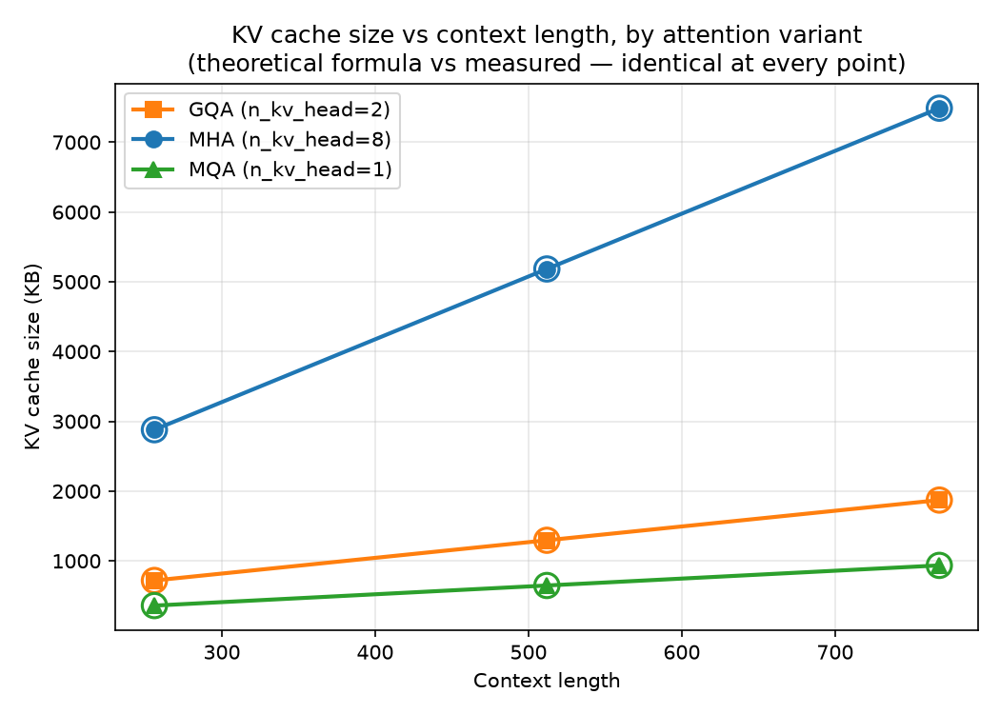
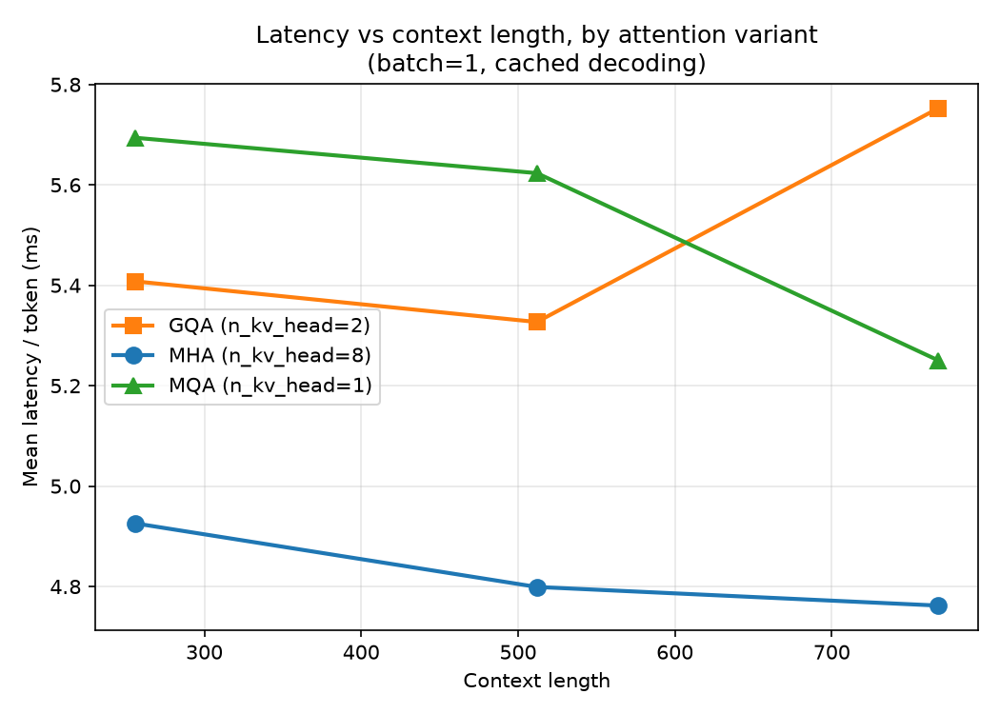
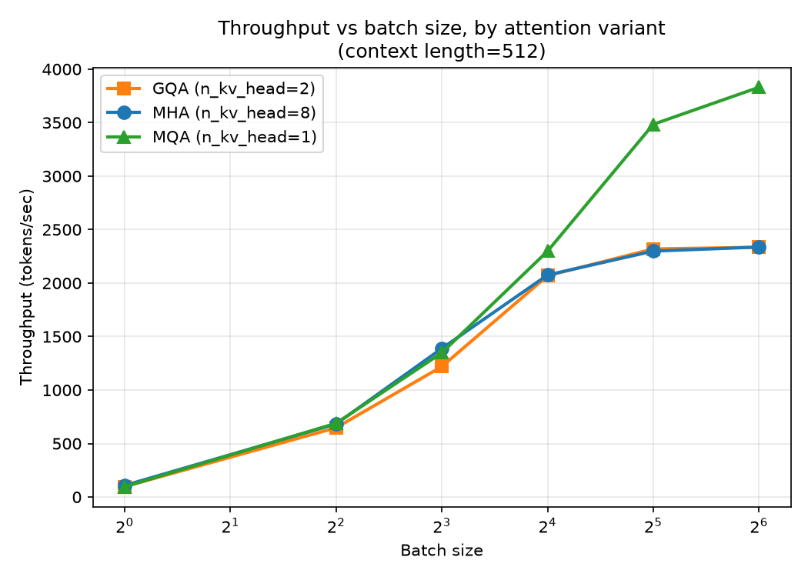

Only the KV projection shrinks as `n_kv_head` drops — Q and output projections stay full size, so this is a *KV cache memory* optimization, not a general parameter-count reduction.

| Variant | Hq | Hkv | KV cache vs MHA |
|---|---|---|---|
| MHA | 8 | 8 | 1× (baseline) |
| GQA | 8 | 2 | 4× smaller |
| MQA | 8 | 1 | 8× smaller |

Measured KV cache sizes (from `benchmarks/memory.py`) match this formula exactly at every context length tested — see [05 — Experiments](#05--experiments).

References: Shazeer, *Fast Transformer Decoding: One Write-Head Is All You Need* (2019); Ainslie et al., *GQA: Training Generalized Multi-Query Transformer Models from Multi-Head Checkpoints* (2023).

## 05 — Experiments

*Latency / memory / throughput / quality.*

All three checkpoints (MHA, GQA `n_kv_head=2`, MQA `n_kv_head=1`) were trained for 5000 iterations on 50M tokens (identical seed, data, and hyperparameters — see `configs/`), then benchmarked at context lengths 256/512/768 (capped below `block_size=1024` to leave room for generated tokens).

**Memory** — KV cache size, measured vs. theoretical formula:

| Context | MHA (bytes) | GQA (bytes) | MQA (bytes) | GQA ratio | MQA ratio |
|---|---|---|---|---|---|
| 256 | 2,949,120 | 737,280 | 368,640 | 4.00× | 8.00× |
| 512 | 5,308,416 | 1,327,104 | 663,552 | 4.00× | 8.00× |
| 768 | 7,667,712 | 1,916,928 | 958,464 | 4.00× | 8.00× |

Measured and theoretical values are identical at every data point.

**Latency** (batch=1, mean ms/token):

| Context | MHA | GQA | MQA |
|---|---|---|---|
| 256 | 4.93 | 5.41 | 5.69 |
| 512 | 4.80 | 5.33 | 5.62 |
| 768 | 4.76 | 5.75 | 5.25 |

**Throughput** (tokens/sec, context=512, sweeping batch size):

| Batch | MHA | GQA | MQA |
|---|---|---|---|
| 1 | 108.7 | 97.0 | 96.5 |
| 4 | 683.5 | 647.9 | 689.3 |
| 8 | 1389.2 | 1219.9 | 1348.8 |
| 16 | 2075.6 | 2068.5 | 2298.5 |
| 32 | 2298.8 | 2319.0 | 3484.1 |
| 64 | 2336.8 | 2334.7 | 3830.1 |

No OOM occurred at any batch size tested, for any variant.

**Quality** (val_loss at iteration 5000, single seed, single 5000-iteration run per variant):

| Variant | val_loss |
|---|---|
| MHA | 5.6314 |
| MQA | 5.6856 |
| GQA | 5.7637 |

## 06 — Analysis

*The compromise observed.*

The results split into two regimes that the single-sequence and batched benchmarks each expose separately.

**Memory scales exactly as predicted, independent of everything else.** Across all three context lengths, GQA's KV cache is precisely 4× smaller than MHA's and MQA's is precisely 8× smaller — matching the `2 × n_kv_head × seq_len × head_dim × dtype_bytes` formula to the byte, with zero drift between the theoretical and measured allocator numbers. This is the one result in this project with no ambiguity: the architecture does exactly what it's supposed to do to the KV cache.

**At batch size 1, MHA is consistently the fastest, not the slowest.** Latency stays essentially flat for MHA across all three context lengths (~4.8ms), while GQA and MQA are both 10-20% slower. The reason traces to the code, not noise: MHA's `repeat_kv` operation takes a no-op fast path when `n_kv_head == n_head` (`n_rep == 1`), while GQA and MQA both pay a real broadcast cost (`expand` + `reshape`) on every forward pass to bring their smaller KV tensor up to the query head count. At this model size (28-30M parameters) and batch size 1, that broadcast cost outweighs any benefit from reading less cache memory — the GPU simply isn't memory-bandwidth-bound at this scale, so a smaller cache has no bandwidth savings to offer against a real per-step compute overhead.

**At high batch size, the picture reverses — but only for MQA, not GQA.** By batch=64, MQA reaches 3830 tokens/sec, a 64% improvement over MHA and GQA, both of which plateau around 2335 tokens/sec. This is the regime the KV-cache-size argument for GQA/MQA is actually built for: total memory traffic scales with `batch_size × kv_cache_bytes`, and once batch size is large enough, that traffic — not the fixed broadcast cost — becomes the bottleneck. MQA's 8× smaller cache produces a corresponding real speedup once that threshold is crossed.

GQA does not show this effect at any batch size tested, despite having a 4× smaller cache than MHA. Two explanations are consistent with the data, and this dataset cannot distinguish between them: (1) GQA's `n_rep=4` broadcast is a real cost MHA doesn't pay at all, and a 4× bandwidth reduction may not be large enough at this model's scale to offset it, while MQA's 8× reduction is; or (2) there may be a bandwidth threshold specific to this model size and T4 hardware that a 4× reduction doesn't cross but an 8× reduction does. Distinguishing these would require testing intermediate `n_kv_head` values (e.g. 4) or a larger base model, which is outside this project's scope.

**No OOM was observed at any batch size tested (up to 64), for any variant.** The original motivation for GQA/MQA — avoiding out-of-memory errors under large batch serving — didn't materialize here because the model is small enough (peak KV cache at batch=64 is 339MB for MHA) that it stays far under a T4's 15GB budget regardless of attention variant. The throughput advantage is real and measurable, but the specific "prevents OOM" framing common in production discussions doesn't apply at this scale; what's observable instead is the more precise underlying mechanism — bandwidth-bound throughput — that the OOM framing is usually standing in for.

**Quality differences are small and not cleanly ordered by architecture.** MHA (5.6314) edges out MQA (5.6856), which edges out GQA (5.7637) — GQA, not MQA, has the worst quality of the three, the opposite of the naive expectation that fewer KV heads should monotonically hurt quality. This is most plausibly training noise at this budget: a single seed, 5000 iterations, 50M tokens is a small run, and a ~0.13 val_loss spread across three runs this short shouldn't be read as a reliable architectural ranking without repeated seeds. This is a genuine limitation of the study as run, not a hidden or overlooked issue — stated here rather than smoothed over.

**Overall:** this dataset supports a real, specific, and narrower claim than "GQA/MQA are strictly better." At this model scale, the correct summary is: attention-variant choice barely matters for single-sequence (batch=1) latency, where the broadcast overhead of any non-MHA variant is a real cost that a smaller cache doesn't yet offset; it starts to matter substantially for throughput once batch size grows large enough to be bandwidth-bound, but only the more aggressive reduction (MQA) showed the benefit at the batch sizes tested here — GQA's intermediate reduction did not. Production serving engines targeting high concurrent batch sizes are exactly the regime where this trade-off pays off, which is consistent with why GQA/MQA are standard there rather than for single-request low-latency serving.

## 07 — Beyond

*FlashAttention, PagedAttention, vLLM.*

> TODO: not implemented here — read for what they say about memory bandwidth and IO-awareness, then explain in your own words where this repo's naive pre-allocated cache breaks down (fragmentation, no batching across requests, no fused kernels) and how each technique addresses a specific piece of that. Section 06's finding that GQA/MQA's broadcast overhead can outweigh their bandwidth savings at small batch is a natural bridge here: FlashAttention-style fused kernels avoid materializing the repeated KV tensor at all, which is precisely the cost identified above.

---

## Repo structure

transformer-inference-lab/
├── train.py # training loop (AdamW + cosine schedule)
├── prepare_data.py # FineWeb-Edu streaming + tokenization
├── BUILDLOG.md # session-by-session project history
├── src/
│ ├── model/
│ │ ├── attention.py # MHA/GQA/MQA as one parameterized module
│ │ ├── transformer.py # GPT wrapper, nanoGPT-speedrun-adjacent
│ │ └── cache.py # KV cache storage/bookkeeping only
│ └── inference/
│ ├── naive.py # no-cache baseline
│ ├── kv_cache.py # prefill + incremental decode with cache
│ └── generation.py # shared sampling utils, perplexity eval
├── experiments/
│ ├── kv_cache/
│ ├── mha_mqa_gqa/
│ └── context_length/
├── benchmarks/
│ ├── latency.py
│ ├── throughput.py
│ └── memory.py
├── analysis/
│ └── plots.py # generates results/figures/*.png from JSON
├── configs/ # mha.yaml / gqa.yaml / mqa.yaml — identical
│ # except n_kv_head
├── results/
│ ├── checkpoints/ # gitignored — too large for git
│ ├── latency/ # JSON benchmark outputs (committed)
│ ├── memory/ # JSON benchmark outputs (committed)
│ ├── throughput/ # JSON benchmark outputs (committed)
│ └── figures/ # PNG plots generated from the JSON above
├── tests/
│ └── test_attention.py # correctness before benchmarking
└── README.md

## Non-goals

This does not aim to match vLLM or TensorRT-LLM performance. The goal is a small enough engine to understand every operation, then measure experimentally why industrial engines reach for more sophisticated techniques.